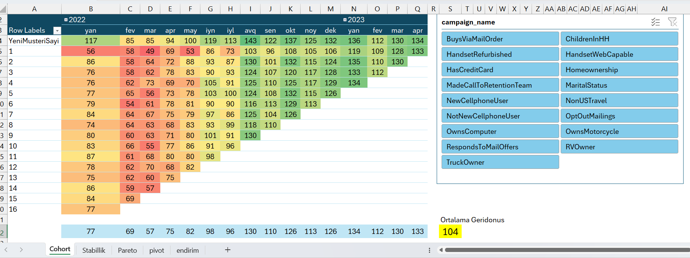
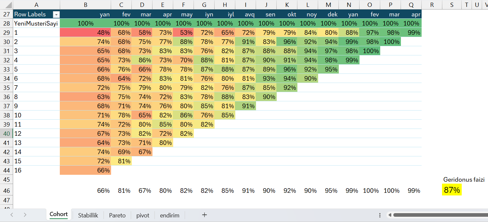
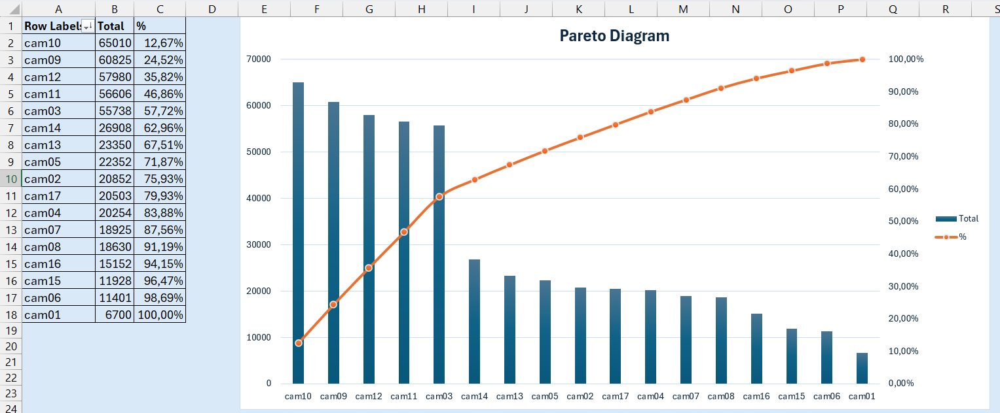

# Deutsche Telekom - Customer Analytics & Discount Optimization (Excel)

Bu proyektdə DeTelecom dataseti üzrə müştəri analizi və yeni marketinq təklifinin verilməsi prosesinin nəticəsi göstərilib.

## 📁 Repository Structure
Şəkillər və vizuallarla analizin son nəticəsini təqdim edirəm.

---

## 📊 Methodology & Key Features

### 1. Cohort Analysis (Customer Retention)
Kohort analizi müştəri davranışlarını izləmə, kompaniya effektivliyini ölçmək üçün mövcud olan ən güclü analizlərdəndir. 
* 
Vizuala əsasən yaşıl xanalar müştəri geridönüşlərinin yuxarı, qırmızı xanalar isə kəskin aşağı düşdüyü dönəmləri göstərir. Kompaniya əlaqəli
slicer verməklə istədiyimiz kompaniyanın effektivliyini və gəlirliliyini bu vizual ilə görə və analiz edə bilərik.
Aşağıda müştəri geridönüşləri  faizlə vizualı da var.
* 
### 2. Pareto Analysis (80/20 Rule)
Pareto analizinin əsas prinspi gələn gəlirlərin əsasını hansı kompaniya/seqment/müştəri təşkil etdiyini görməkdir. Burada kompaniyalara uyğun gəlirlərə görə 
Pareto diaqramı qurulmuşdur. 
* 
Diaqrama əsasən gəlirlərin təxminən 60% hissəsini 3,9,10,11 və 12 nömrəli kompaniyalardan gəldiyini görürük. Bu bizə imkan verir ki, gəlirli kompaniyaların xüsusiyyətlərini digər zəif gəlirli kompaniyalara tətbiq edərək gücləndirək və ya aşağı gəlirli kompaniyalar yerinə yeni və yüksək gəlir potensiallı kompaniyalar yaradaq.
### 3. Campaign Stability Metrics
Digər vizualda sırf kompaniyalar və gəlirlərindən ibarət bir cədvəl hazırlamışam. Burada yaratdığımız marketing kompaniyalarının stabilliyini yəni aylar üzrə gəlirliliyinin ortalamadan fərqlənməsi dərəcəsini ölçmüşəm.
* 
Ən stabil gəliri olan 3 kompaniya sarı xana ilə fərqləndirilib həmçinin burada şərti formatlama ilə stabilliyi fərqləndirmişəm ( yaşıl (Max) -- qırmızı (min).
## 4. YEKUN NƏTİCƏ
Aşağıdakı vizualda isə müştərilərimizin davranışlarına əsasən yekun olaraq xüsusi marketinq kompaniyası təklifi hazırlamışam.
Belə ki, müştərimizin son istifadə etdiyi tarif onun ümumi istifadə etdiyi tariflər arasında ən böyükdürsə xüsusi bir kompaniya verilməsin yox əgər daha əvvəl yüksək məbləğli bir tarif istifadə edibsə o zaman ona həmən tarif 20% endirimlə təklif olunsun.
Hansı müştərilərə hansı tariflərin (kampaniyaların) endirimlə təklif olunacağı vizualı aşağıdadır.
* 
